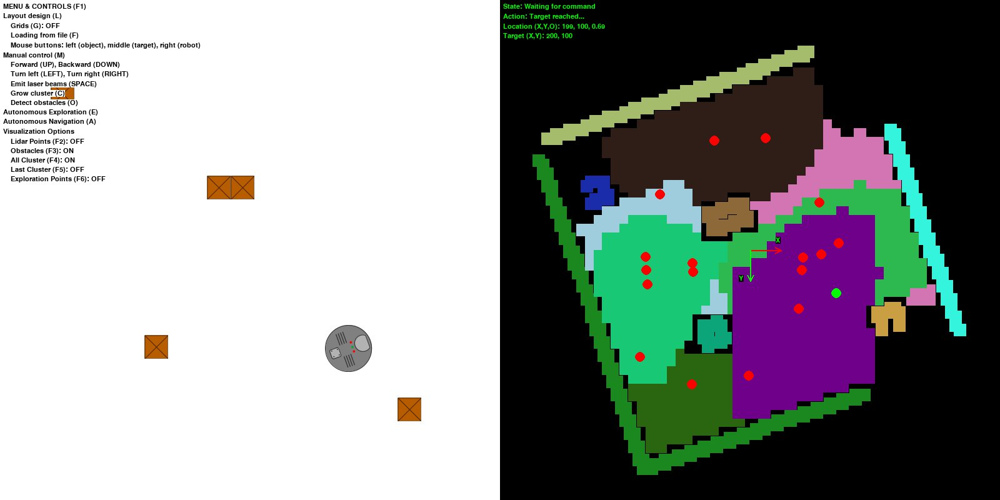
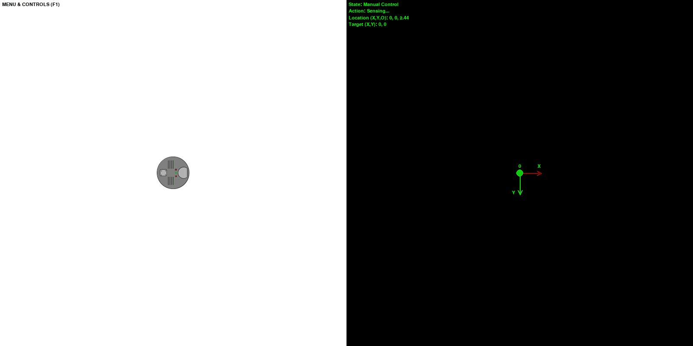
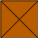
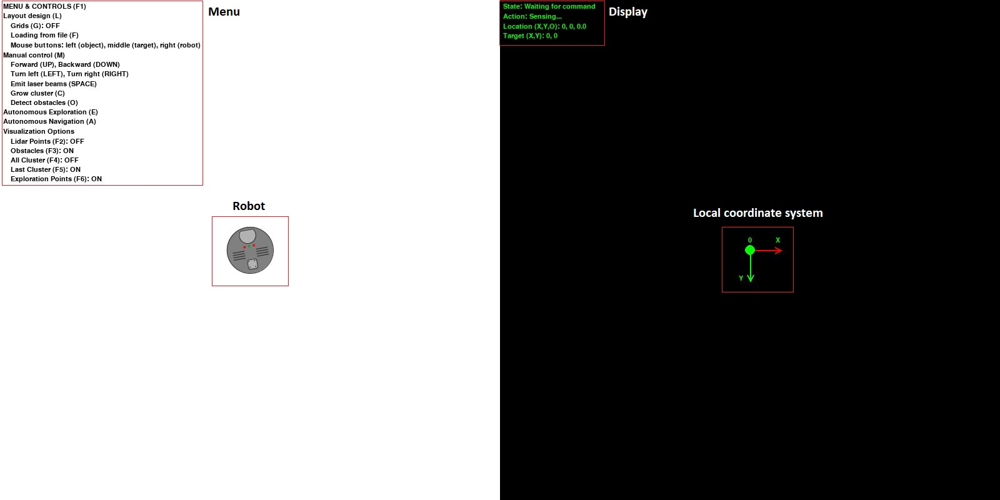
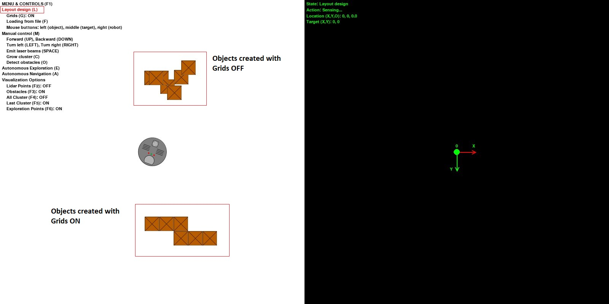
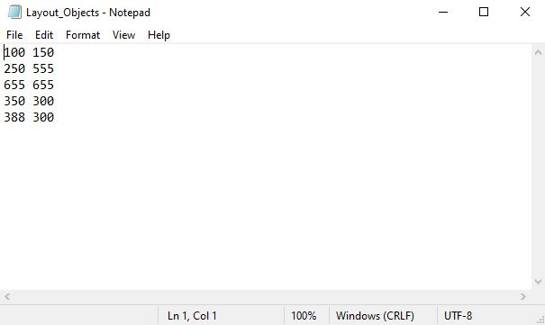

# Robot Topological Mapping by Adam

## Motivation
This application was created as my final project for [Harvard's CS50 course](https://online-learning.harvard.edu/course/cs50-introduction-computer-science?delta=0).

I wanted to learn something new and robotics seemed to be an interesting field. 
So, I looked some papers up, and the field of navigation & mapping seemed to have some challenges.
An interesting paper on topological mapping crossed my way: 
[Blochlinger et al (2017): Topomap: Topological Mapping and Navigation Based on Visual SLAM Maps](https://ieeexplore.ieee.org/document/8460641).
After reading the paper, I decided to make a small 2D simulation to implement this mapping approach with [Python](https://www.python.org/).

## Short description
In the simulation, there is one robot that tries to autonomously explore and navigate in its world. 
The world is a closed 800 by 800 px layout with square-shaped objects in it. 
The robot uses its sensor to explore the objects around itself and builds a map by using the sensor information.
In each step of the autonomous exploration the robot decides to which direction and how far to move.
When the autonomous exploration is completed, the robot builds a topological map with nodes for autonomous navigation.
During the autonomous navigation the robot creates a path from the starting point to the target point by using the [A* search algorithm](https://en.wikipedia.org/wiki/A*_search_algorithm).

A few words about the user interface. The main window shows two screens, see below:
* The layout with the main menu on the left side;
* The robot's map with a status display on the right side.

There are four main control modes:
* Layout design: this allows the user to create a layout interactively or load it from file.
* Manual control: this allows the user to manually control the robot. This was introduced to debug the program, so it has limited capabilities.
* Autonomous exploration: in this mode the robot makes a predefined amount of exploration step.
* Autonomous navigation: in this mode the robot navigates from its current location to the target location.

## Simulation components & settings
In this section we go through the simulation components and their settings.
### Robot
Let's start with the robot, shown below.

The robot's global position is initialized from the layout design, so the user can control it.
Contrary to this, the robot's orientation is always random.

The robot can move forwards, backwards. 
The robot's movement speed is defined in the *settings.py* file.
If the robot collides with and object, or it reached the perimeter of the layout it cannot move forward.

The robot can turn left and right. 
In manual mode this happens incrementally (5 degree). 
In autonomous modes, this happens continuously, however, the visualisation of the robot's orientation happens incrementally.
This means that if the robot's orientation is 24 degree then its image on the screen shows 25 degree orientation.

The robot uses its local coordinate system to define its position:
* The origin of the local coordinate system is always (0, 0). 
  This means that if the robot's initial global position on the layout is (400, 400), its position in the local coordinate system is (0, 0).
* The X-axis of the local coordinate system always defined by the initial orientation.

The robot uses odometry to keep track of its movement and orientation in the local coordinate system:
* We assume that the robot's odometry is **perfectly accurate**. 
  With other words there is no slip between the robot's wheels and the floor: 
  if the robot moves 1 meter in direction X then it ends up exactly 1 meter away in direction X.
* However, in autonomous mode there are tolerances:
  * A tolerance has to be set to define whether the robot's reached its current target position or not.
  This can be found in the *settings.py* file: robot_target_distance_tolerance
  * Similarly, a tolerance has to be set to define whether the robot is oriented into the right direction.
  This can be found in the *setting.py* file: robot_orientation_tolerance
  
The robot stores its current target position. It is also aware of being in the target position or not.

#### Sensor & laser beams
The robot uses its laser (LIDAR) sensor to detect objects. 

The sensor emits laser beams that are represented with small rectangular shapes. 
The following settings can be defined in the *settings.py* file:
* laser_color: the color of the laser beams
* laser_width / height: width and height of the rectangle
* laser_speed: moving speed of the laser beams
* laser_number: the total number of the emitted laser beams at once

Apart from this the there are sensor (LIDAR) settings in the *settings.py* file:
* lidar_view_angle: the view angle of the sensor
* lidar_sensing_distance: the maximum distance between the robot and laser beams

Based on the total number of laser beams and lidar's view angle the moving direction of each laser beam is calculated.
When the robot emits the laser beams they start to move away from the robot in the defined direction.
The distance between each laser beam and robot is continuously calculated:
* The further the beam from the robot the lighter its color is
* If the beam reached the maximum sensing distance then it is removed

If a laser beam hits an object then we remove it, and the collision point is added to the map.

### Object
The objects are static elements on the layout. 
Their global position is initialized from the layout design, so the user can control it.

### Map

## User interface and controls
After the program is executed the startup screen shows up, see below! On the left side we can see the active menu and the robot in the center of the layout. 

By using the keyboard we can select control and visualisation option from the menu:
* F1: shows / hides the menu.
* L: activates the layout design mode
    * G: activates the grids if we are in the layout design mode. When the girds are activated, the objects jumps on the closest grids during creation.
    * F: loads the layout from file.
    * Mouse buttons:
        * Left-click on the layout area: creates a new object.
        * Middle-click on the layout area: creates a new target point (see later in the autonomous navigation section).
        * Right-click on the layout area: replaces the robot.
* M: activates the manual control mode
    * Arrows (UP, DOWN, LEFT, RIGHT): moves and rotates the robot.
    * SPACE: the robot emits laser beams.
    * C: the robot grows a cluster at its current location.
    * O: the robot detects the obstacles (points that form one obstacle entity).
* E: activates autonomous exploration.
* A: activates autonomous navigation.
* Visualization options:
    * F2: shows / hides the lidar points on the map.
    * F3: shows / hides the obstacles on the map.
    * F4: shows / hides all the clusters on the map.
    * F5: shows / hides the last explored cluster on the map.
    * F6: shows / hides the exploration points on the map.
  
On the right side we can see the empty map with the robot's local coordinate system and the display.
The display shows information about the robot:
* State, the current state of the robot:
    * Waiting for command: the robot waits for the next command
    * Manual control: the robot is in manual control mode
    * Autonomous exploration: the robot is in autonomous exploration mode
    * Autonomous navigation: the robot is in autonomous navigation mode
* Action, the current action of the robot:
    * Sensing: the robot uses its sensor to detect surrounding obstacles
    * Moving: the robot moves to the target point
    * Target reached: the robot reached its target
* Location, the location of the robot in its local coordinate system
    * X: x-coordinate
    * Y: y-coordinate
    * O: orientation to the X-axis
* Target, the current target of the robot in its local coordinate system
    * X: x-coordinate
    * Y: y-coordinate

### Layout design
When we enter into the layout design mode, it is shown in the menu with red fonts, see below.

**Reminder:** the origin of the layout (global coordinate system) is the top-left corner of the window. 
The x-axis goes from left to right. 
The y-axis goes from top to bottom.

#### Grids
When the grids option is active, then the objects snap to the closest grid. 
Otherwise, the object will be created right at the current position of the cursor. You can see an example below!

#### Loading from file
The positions of the objects and the robot can be stored in text files. 
In these files we have to define the X & Y coordinates of the objects, separated by whitespace: one line per object.
An example is shown below!

The file paths have to be defined in the *settings.py* file:
* layout_object_filename;
* layout_robot_filename.

### Manual control mode
This mode was implemented to make debugging easier, so its functionality is limited.
When this mode is active, its font color turns into red in the menu.

With the arrow key the movement of the robot can be controlled. Laser beams can be emitted by the SPACE button.

A cluster can be grown at the current location of the robot by the pushing the C button.

The obstacle detection can be activated by pushing the O button.

**Warning:** if you switch between the manual and autonomous modes the simulation can crash. 
The program is not designed to handle these type of actions.

### Autonomous exploration
In this mode the robot attempts to explore its world. This works in the following way:
1. The robot turns 360 degrees stepwise
    * 

## References
1. [Blochlinger et al (2017): Topomap: Topological Mapping and Navigation Based on Visual SLAM Maps](https://ieeexplore.ieee.org/document/8460641).

